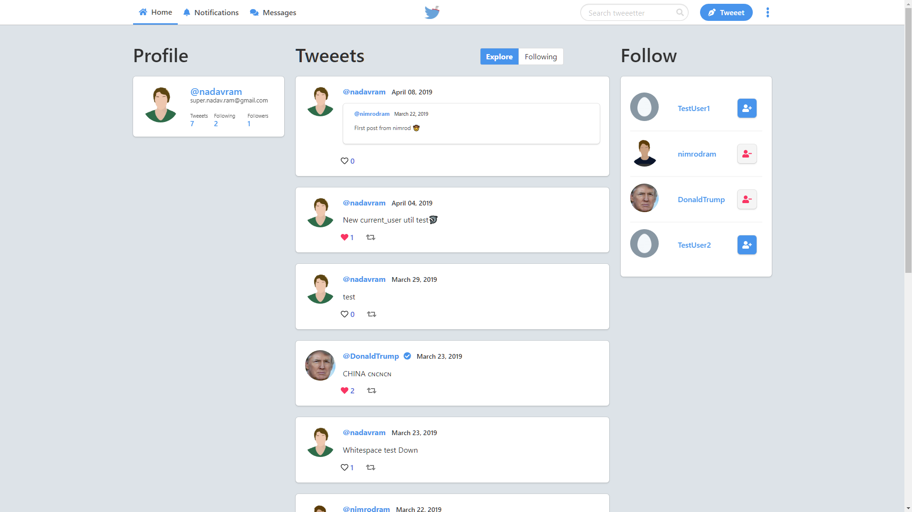

# flask-tweeeter

### A full-stack Twitter clone made using the Flask framework for Python 🐦

<br/>

A beginner project using the following stack:
* Python
* Flask
* SQLAlchemy (ORM)
* Flask Migrate
* Sha_256 (PASSWORD HASHING)
* WTForms (REGISTRATION FORMS)
* Bulma CSS framework

<br/>



<br>

# Tweeeter Installation

First clone mapnik from github

```bash
git clone https://github.com/nadav-ram/flask-tweeeter.git
cd flask-tweeeter
```

To create a virtualenv:

```bash
pip install virtualenv
virtualenv <choose an env name>
```

To use the env on Unix:

```bash
source <env name>/bin/activate
```

To use the env on Windows:

```bash
source <env name>/Scripts/activate
```

Install the requirements:

```bash
pip install -r requirements.txt
```

<br>

### To run the app make sure you have python 3.7.2 or greater.

<br>

To run the app on Unix:

```bash
cd flaskapp && python3 app.py
```

To run the app on Windows:
```bash
cd flaskapp && python app.py
```

<br>

### Now open you browser to localhost:5000 and try it out :)